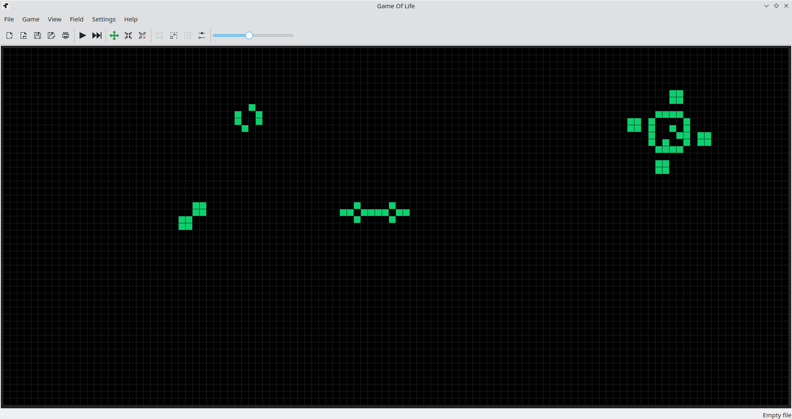
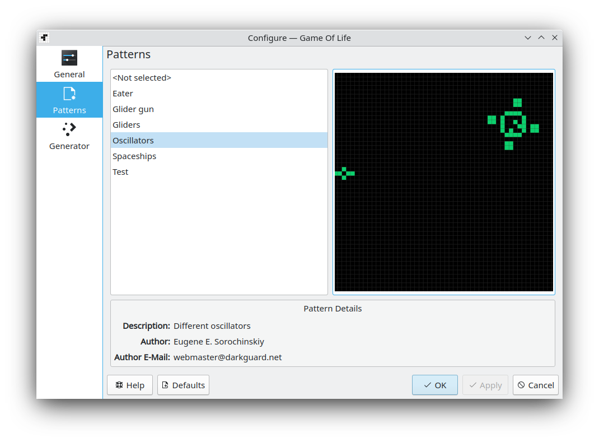
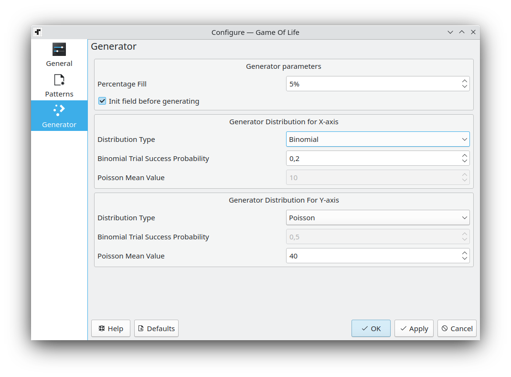

# KGLife

Game Of Life from J. H. Conway

Current features:

* Load save and edit cell patterns
* Pattern printing support
* Supports work with different file formats: native, XLife RLE, CELLS
* A set of pre-installed patterns
* Flexible color settings

## Screenshots







## Build

```bash
mkdir -p build && cd build
cmake .. -DCMAKE_INSTALL_PREFIX=/path/to/kde/datadir -G"Unix Makefiles" -DCMAKE_BUILD_TYPE=Release \
        -DKDE_INSTALL_USE_QT_SYS_PATHS=false \
        -DENABLE_TESTING=OFF \
        -DBUILD_TESTING=OFF \
        -DKDE_SKIP_TEST_SETTINGS=ON
cmake --build .
```

## Installation after build

```bash
cmake --install .
```

## License

This project is licensed under GPL-3.0-or-later.
